# Classroom

## Overview

Classroom is a comprehensive learning management system (LMS) designed to bridge the gap between instructors and students through a unified digital platform. Built with modern web technologies, it provides a seamless experience for course creation, enrollment management, assignment distribution, and progress tracking. The platform addresses the core challenges of online education by consolidating scattered workflows into a cohesive, intuitive system that prioritizes clarity and structure.

## Features

### For Instructors

- **Course Creation & Management**: Design and publish courses with detailed metadata including title, description, category, difficulty level, and thumbnail images
- **Dashboard Analytics**: Monitor total courses created, student enrollment statistics, and pending assignment reviews through an intuitive dashboard
- **Course Portfolio Management**: View and manage all published courses with real-time enrollment data and completion rates
- **Assignment Distribution**: Create and distribute assignments with deadlines and track submission status
- **Material Upload**: Organize and share learning materials (PDFs, videos, links) within course modules

### For Students

- **Course Discovery**: Browse comprehensive course catalog with advanced search and filtering by category, level, and rating
- **Enrollment System**: One-click enrollment in courses with instant access to materials and assignments
- **Progress Tracking**: Visual dashboard displaying enrolled courses, completion percentages, and recent activity
- **Personalized Learning**: Access enrolled courses through a dedicated "My Courses" section with progress indicators
- **Assignment Management**: View assignments with due dates and submission status tracking

### Platform Features

- **Role-Based Access Control**: Separate authentication flows and dashboards for instructors and students
- **Responsive Design**: Fully responsive UI optimized for desktop, tablet, and mobile devices
- **Real-Time Updates**: Dynamic content updates without page reloads using React client components
- **Course Rating System**: 5-star rating display with review counts and student enrollment metrics
- **Smooth Navigation**: Intersection Observer-based active section highlighting in navigation

## Tech Stack

### Frontend Framework

- **Next.js 16.1.6**: React-based framework with App Router for server-side rendering and routing
- **React 19.2.3**: Component-based UI library with hooks for state management
- **TypeScript 5.x**: Static typing for enhanced code quality and developer experience

### Styling & UI

- **Tailwind CSS 4.x**: Utility-first CSS framework for rapid UI development
- **Custom Design System**: Consistent color palette (#4F46E5 primary, #F9FAFB background) and typography
- **Geist Font Family**: Optimized font loading using next/font for improved performance

### Development Tools

- **ESLint 9.x**: Code linting with Next.js configuration for code quality enforcement
- **PostCSS**: CSS processing with Tailwind CSS integration
- **TypeScript Compiler**: Strict type checking with ES2017 target and JSX support

### Architecture Patterns

- **App Router Architecture**: File-based routing with nested layouts and route groups
- **Client-Side State Management**: React Context API for enrollment state management
- **Component Composition**: Reusable components with props-based customization
- **Image Optimization**: Next.js Image component for automatic image optimization

## Screenshots

### Landing Pages

<p align="center">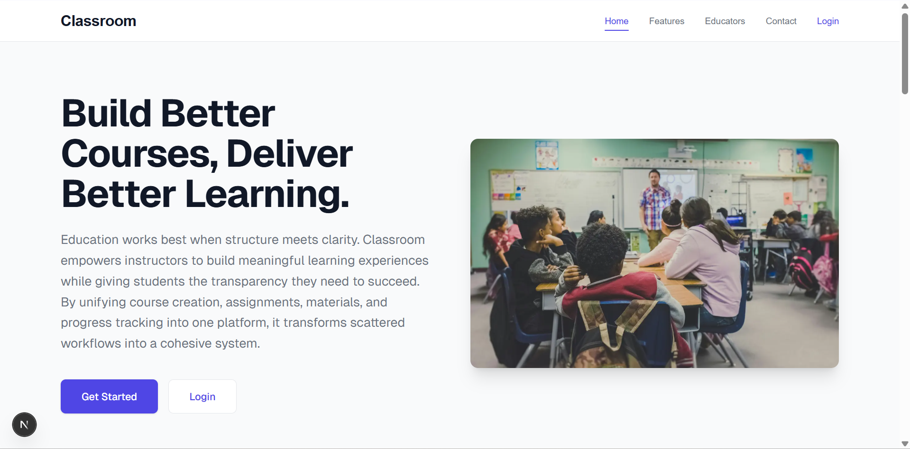</p>

<p align="center">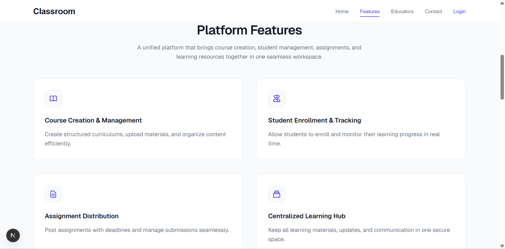</p>

<p align="center">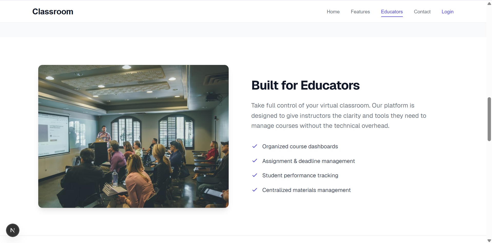</p>

<p align="center">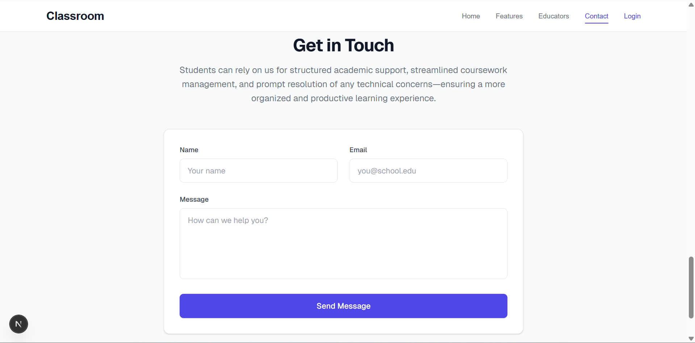</p>

---

### Authentication

<p align="center">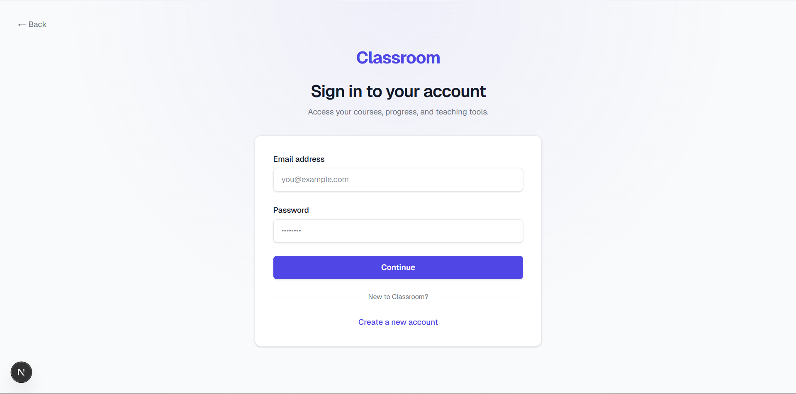</p>

<p align="center">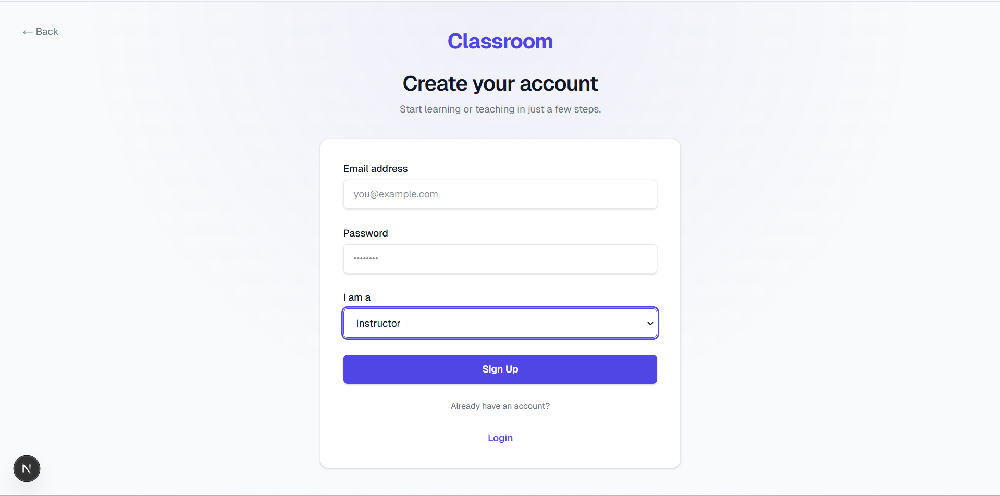</p>

<p align="center">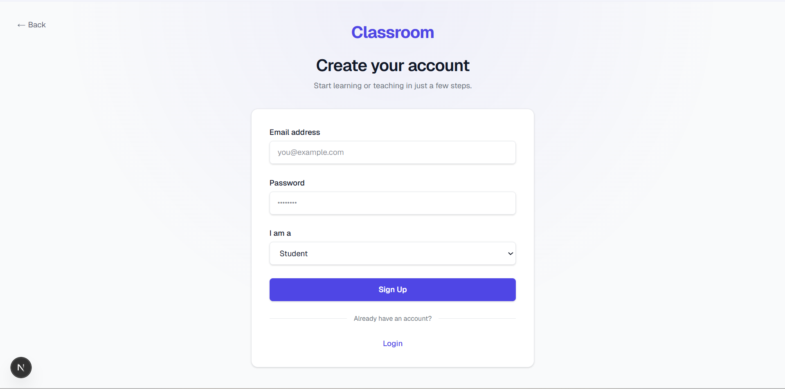</p>

---

### Student Module

<p align="center">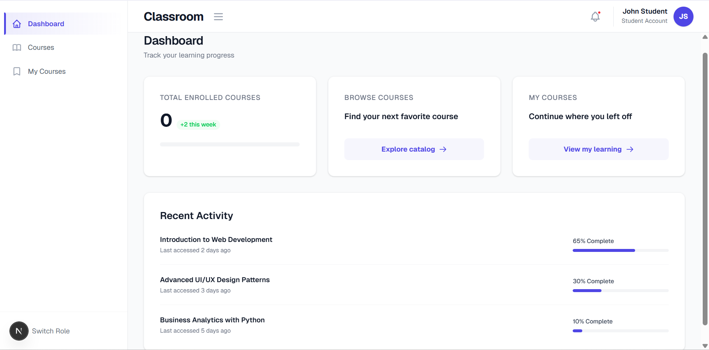</p>

<p align="center">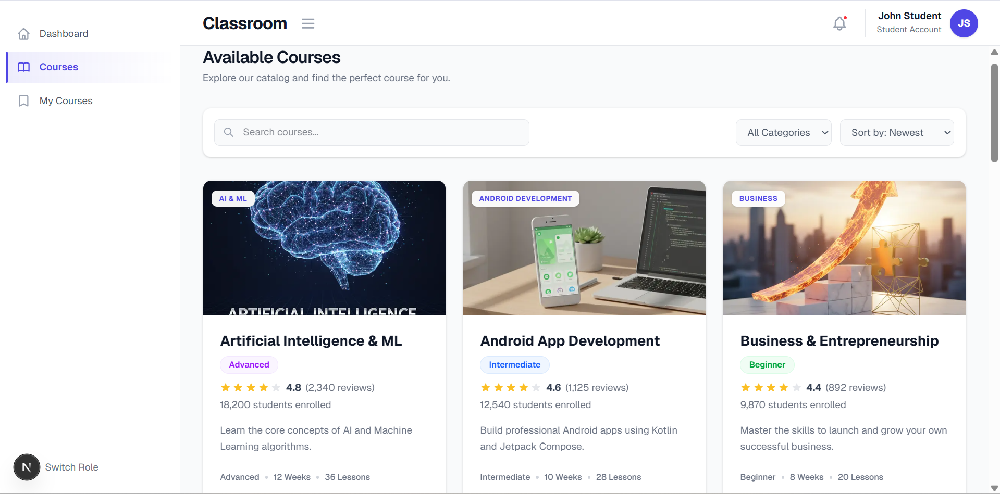</p>

<p align="center">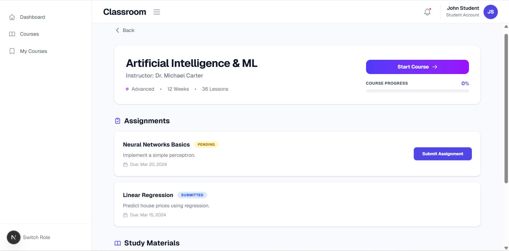</p>

<p align="center">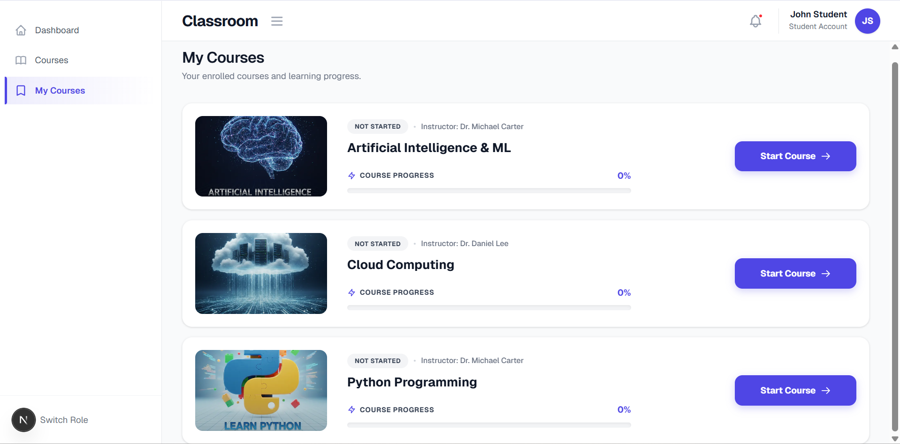</p>

---

### Instructor Module

<p align="center">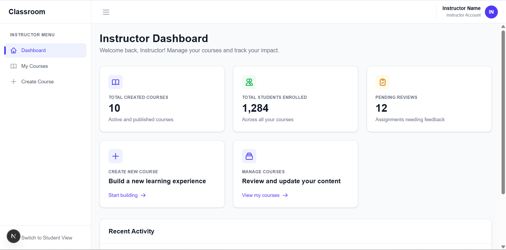</p>

<p align="center">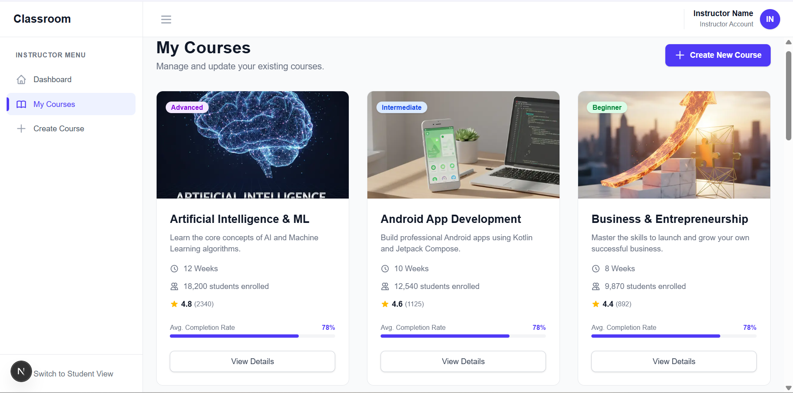</p>

<p align="center">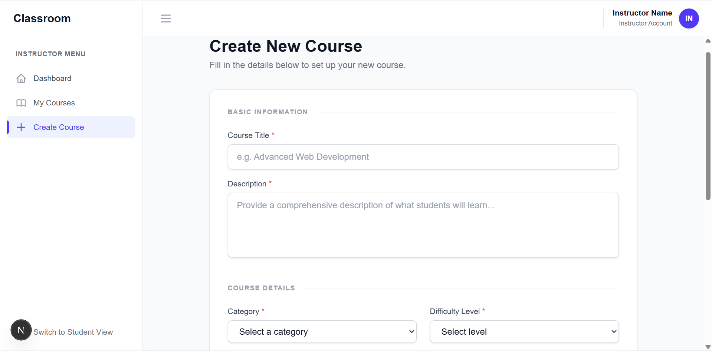</p>

<p align="center">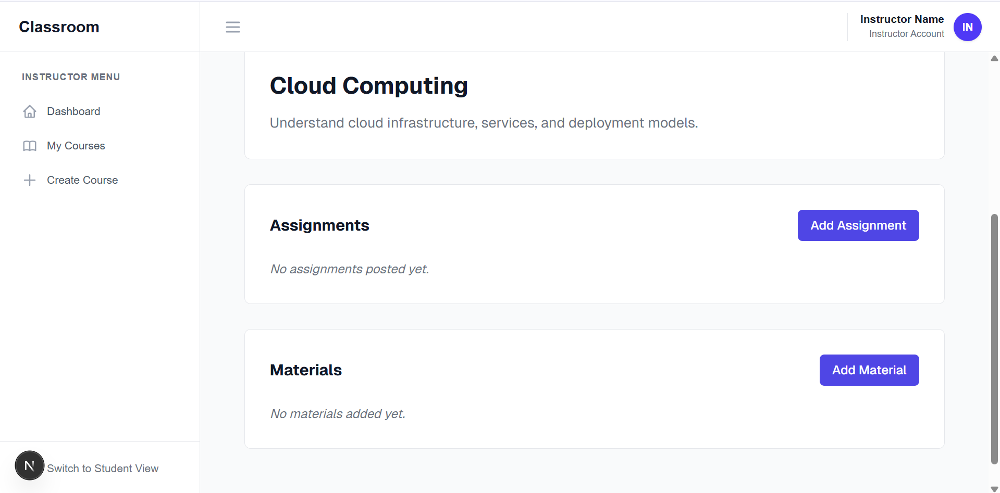</p>

---

## Getting Started

### Prerequisites

- Node.js 20.x or higher
- npm, yarn, pnpm, or bun package manager

### Installation

1. Clone the repository:

```bash
git clone <repository-url>
cd classroom
```

2. Install dependencies:

```bash
npm install
```

3. Run the development server:

```bash
npm run dev
```

4. Open [http://localhost:3000](http://localhost:3000) in your browser

### Available Scripts

- `npm run dev` - Start development server with hot reload
- `npm run build` - Create optimized production build
- `npm run start` - Start production server
- `npm run lint` - Run ESLint for code quality checks

## Project Structure

```
classroom/
├── app/
│   ├── (auth)/
│   │   ├── login/
│   │   │   └── page.tsx                    # Login page
│   │   ├── signup/
│   │   │   └── page.tsx                    # Signup page
│   │   └── layout.tsx                      # Auth layout
│   ├── data/
│   │   └── courses.ts                      # Course data and TypeScript interfaces
│   ├── instructor/
│   │   ├── courses/
│   │   │   ├── [id]/                       # Dynamic course detail page
│   │   │   └── page.tsx                    # Instructor courses list
│   │   ├── create-course/
│   │   │   └── page.tsx                    # Course creation form
│   │   ├── dashboard/
│   │   │   └── page.tsx                    # Instructor dashboard
│   │   └── layout.tsx                      # Instructor layout
│   ├── student/
│   │   ├── courses/
│   │   │   └── page.tsx                    # Browse available courses
│   │   ├── dashboard/
│   │   │   └── page.tsx                    # Student dashboard
│   │   ├── my-courses/
│   │   │   ├── [id]/                       # Dynamic enrolled course detail
│   │   │   └── page.tsx                    # My enrolled courses
│   │   └── layout.tsx                      # Student layout
│   ├── favicon.ico                         # App favicon
│   ├── globals.css                         # Global styles and Tailwind imports
│   ├── layout.tsx                          # Root layout with navigation
│   └── page.tsx                            # Landing page
├── components/
│   ├── Navbar.tsx                          # Main navigation component
│   └── NavbarGate.tsx                      # Navigation gate component
├── public/
│   ├── course-thumbnails/                  # Course thumbnail images
│   │   ├── AiMi.png
│   │   ├── android-development.png
│   │   ├── bussiness-entrepreneurship.png
│   │   ├── cloud-computing.png
│   │   ├── cyberse-curity.png
│   │   ├── database.png
│   │   ├── dsa.png
│   │   ├── html.png
│   │   ├── python.png
│   │   └── ui-ux.png
│   ├── classroom-image.jpg                 # Main classroom image
│   ├── file.svg                            # File icon
│   ├── globe.svg                           # Globe icon
│   ├── next.svg                            # Next.js logo
│   ├── vercel.svg                          # Vercel logo
│   └── window.svg                          # Window icon
├── screenshots/
│   ├── auth/
│   │   ├── instructor_signup_page.png
│   │   ├── login_page.png
│   │   └── student_signup_page.png
│   ├── instructor_dashboard/
│   │   ├── courses.png
│   │   ├── create_course_details.png
│   │   ├── instructor_course_details.png
│   │   └── instructor_dashboard.png
│   ├── landing_page/
│   │   ├── contact.png
│   │   ├── educators.png
│   │   ├── features.png
│   │   └── home.png
│   └── student_dashboard/
│       ├── available_courses.png
│       ├── enrolled_courses.png
│       ├── student_course_details.png
│       └── student_dashboard.png
├── .gitignore                              # Git ignore rules
├── eslint.config.mjs                       # ESLint configuration
├── next.config.ts                          # Next.js configuration
├── package.json                            # Project dependencies and scripts
├── postcss.config.mjs                      # PostCSS configuration
├── README.md                               # Project documentation
└── tsconfig.json                           # TypeScript configuration
```

## License

This project is developed for educational purposes.
