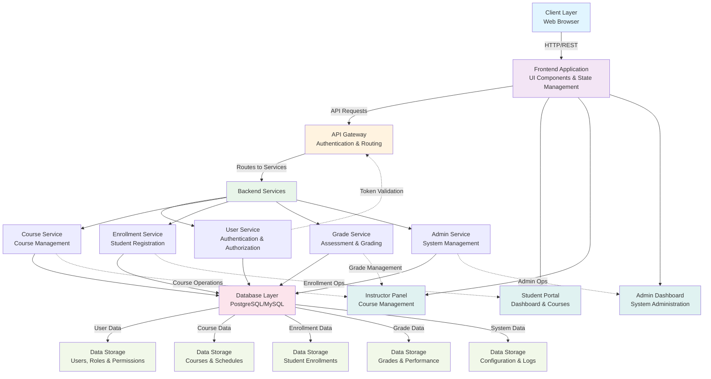

# Contribution Report

## Project Collaboration Overview

The **ClassRoom Course Management App** represents a collaborative effort among five key contributors who worked in tandem to develop a comprehensive platform for managing academic courses, student information, and educational workflows. This report documents the individual contributions of each team member, highlighting their specific roles in the application's architecture, implementation, and deployment. The project demonstrates a well-coordinated development process with clear task distribution and technical collaboration.

## System Architecture & Data Flow

## Individual Contributions

### Harsh

- **Backend API Development & Database Architecture**: Designed and implemented RESTful API endpoints for core functionality including course management, student enrollment, and grade tracking systems, ensuring scalable and efficient database schemas.
- **Authentication & Security Implementation**: Developed robust user authentication mechanisms with role-based access control (RBAC) to manage different permission levels for administrators, instructors, and students.
- **Server Configuration & Deployment**: Set up server infrastructure, configured deployment pipelines, and managed production environment configurations to ensure system stability and performance.
- **API Documentation & Integration Testing**: Created comprehensive API documentation and developed integration test suites to validate backend functionality and ensure seamless communication between frontend and backend services.

### Sunil

- **Frontend UI/UX Development**: Built responsive and intuitive user interfaces for dashboard, course listing, and student enrollment modules using modern web technologies and design principles.
- **Frontend State Management**: Implemented client-side state management solutions to handle complex data flows, user interactions, and real-time updates across application pages.
- **Form Validation & Data Handling**: Developed client-side validation logic and forms for student registration, course enrollment, and grade submission with enhanced error handling and user feedback mechanisms.
- **Cross-browser Compatibility Testing**: Ensured application functionality across multiple browsers and devices, optimizing performance and user experience for diverse user bases.

### Kishan

- **Full-Stack Architecture & Project Setup**: Established the overall project structure, set up development environment configurations, and defined the technical foundation for both frontend and backend components.
- **Database Schema Design & Optimization**: Designed efficient database schemas for storing course information, student records, grades, and enrollment data with proper indexing and query optimization.
- **Core Feature Implementation**: Developed key features including student enrollment workflows, course information management, and dashboard functionalities that form the backbone of the application.
- **Code Review & Quality Assurance**: Conducted code reviews to maintain code quality standards, identified potential issues, and provided technical guidance to ensure consistency across the codebase.

### Payaswini

- **User Interface Design & Frontend Components**: Designed and developed reusable UI components for various pages including course catalog, student profiles, and administrative dashboards with consistent visual design.
- **Student Portal Features**: Implemented features specifically for student-facing interfaces such as course registration, grade viewing, course materials access, and notification systems.
- **Responsive Design Implementation**: Ensured mobile and tablet responsiveness of the application, adapting layouts and interactions for various screen sizes and device types.
- **UI/UX Testing & Refinement**: Conducted user experience testing, gathered feedback, and refined interface elements to enhance usability and accessibility for end users.

### Chandhini

- **Admin Panel Development**: Built comprehensive administrative interfaces for managing courses, user accounts, student records, and system settings with intuitive navigation and controls.
- **Reporting & Analytics Features**: Developed reporting modules that provide insights into course enrollment statistics, student performance metrics, and system usage analytics.
- **Data Management & Bulk Operations**: Implemented features for bulk uploading student data, course schedules, and grades, streamlining administrative workflows and reducing manual data entry.
- **User Management System**: Created user account management functionality including profile management, permission assignment, and access control administration for system administrators.

## Development Workflow

The team employed an organized development process with clear separation of concerns and regular collaboration:

- **Version Control**: All code changes were managed through Git with structured branching strategies to maintain code integrity and facilitate parallel development.
- **Sprint-Based Development**: The project was developed in iterative cycles, allowing the team to incrementally build features, gather feedback, and refine implementations.
- **Continuous Integration**: Automated testing and build processes were implemented to ensure code quality and catch issues early in the development lifecycle.
- **Team Communication**: Regular synchronization meetings and code reviews ensured alignment among team members and maintained consistency with project objectives.

## Conclusion

The successful completion of the ClassRoom Course Management App is a testament to the collaborative efforts and technical expertise of all team members. Each contributor brought specialized skills in full-stack development, UI/UX design, database management, and system administration. The project demonstrates professional software development practices with well-defined responsibilities, quality assurance mechanisms, and a focus on delivering a reliable, user-friendly platform for educational institutions. This collaborative approach not only produced a functional application but also established a strong foundation for future maintenance and enhancement initiatives.

---

**Report Generated**: 2026-02-18
